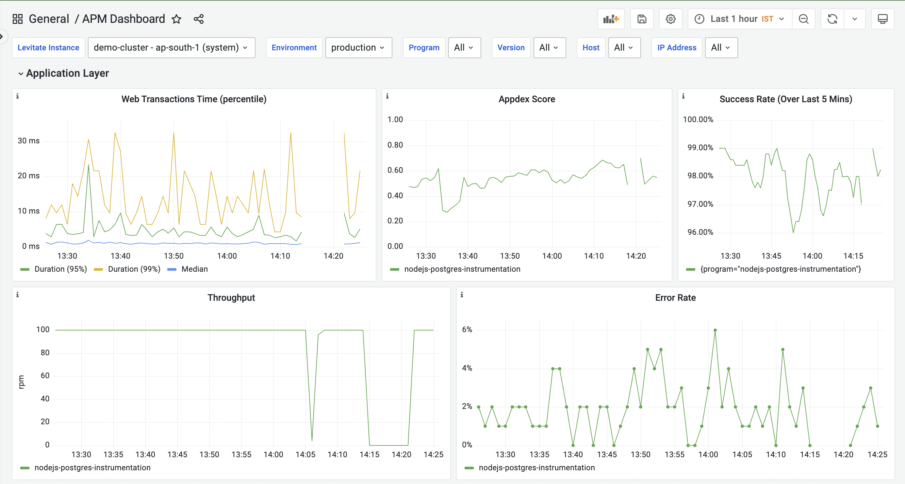
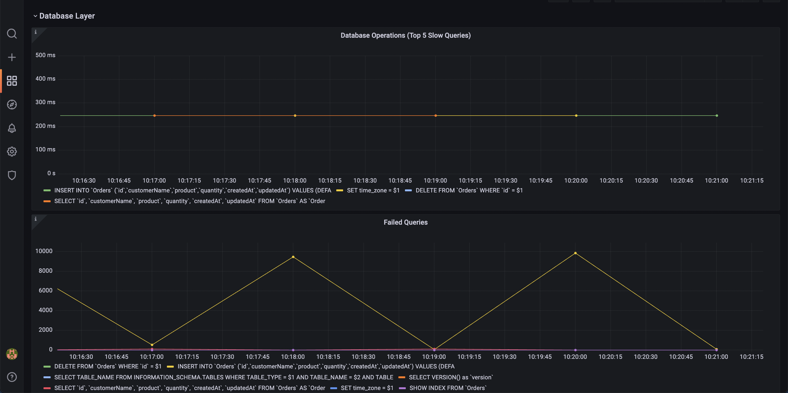
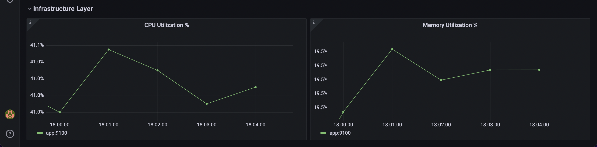

<a href="https://last9.io"></a>

# @last9/openapm
An APM solution based on metrics and open-source tools such as Prometheus and Grafana for NodeJs-based applications.

## Table of Contents
1. [Installation](#installation)
2. [Usage](#usage)
3. [Options](#options)
4. [Setup Locally](#setup-locally)
5. [Grafana Dashboard View](#grafana-dashboard-view)
6. [About Last9](#about-last9)

## Installation

```
npm install --save @last9/openapm@latest
```

## Usage

1. [Express](#express)
2. [MySQL](#mysql)
3. [NestJS](#nestjs)

### Express

In the example below, the metrics will be served on `localhost:9097/metrics`. To
change the port, you can update it through the options
([See the options documentation](#options)).

```js
const express = require('express')
const { OpenAPM } = require('@last9/openapm')

const app = express();
const openapm = new OpenAPM();

app.use(openapm.REDMiddleware);

// ...

app.listen(3000)

```

### MySQL

This currently supports instrumentation for all Node.js ORMs, which are [mysql2](https://www.npmjs.com/package/mysql2) compatible.

Ensure to add this line of code before you initialize db `connection/pool/poolCluster`.

```js
openapm.instrument('mysql');
```

### NestJS

OpenAPM currently supports RED Metrics for NestJS v4 and above.

```js
openapm.instrument('nestjs');
```

## Options

### Usage

```js
const openapm = new OpenAPM({
  // Options go here
});
```

1. `path`: The path at which the metrics will be served. For eg. `/metrics`
2. `metricsServerPort`: (Optional) The port at which the metricsServer will run.
3. `environment`: (Optional) The application environment. Defaults to
   `production`.
4. `defaultLabels`: (Optional) Any default labels to be included.
5. `requestsCounterConfig`: (Optional) Requests counter configuration, same as
   [Counter](https://github.com/siimon/prom-client#counter) in `prom-client`.
   Defaults to

   ```js
   {
      name: 'http_requests_total',
      help: 'Total number of requests',
      labelNames: ['path', 'method', 'status'],
    }
   ```

6. `requestDurationHistogramConfig`: (Optional) Requests Duration histogram
   configuration, the same as
   [Histogram](https://github.com/siimon/prom-client#histogram) in
   `prom-client`. Defaults to
   ```js
    {
        name: 'http_requests_duration_milliseconds',
        help: 'Duration of HTTP requests in milliseconds',
        labelNames: ['path', 'method', 'status'],
        buckets: promClient.exponentialBuckets(0.25, 1.5, 31),
      }
   ```
7. `extractLabels`: (Optional) Extract labels from URL params (WIP: Headers, Subdomain)
   ```js
   // To extract from the URL params
   {
      ...
      extractLabels: {
         tenant: { // Here 'tenant' is the label name
            from : 'params',
            key: 'org' // Which key to extract from the params
            mask: ':org' // Replacement string
         }
      }
   }
   ```
8. `excludeDefaultLabels`: (Optional) Provide labels to exclude from the default labels

```js
{
  ...
  excludeDefaultLabels: ['environment', 'version']
}
```

9. `levitateConfig`: (Optional) Configuration for Levitate TSDB. Adding this configuration will enable the [Change Events](https://docs.last9.io/docs/change-events).

```js
{
   ...
   levitateConfig: {
      host: 'https://app.last9.io',
      orgSlug: 'last9', /** The slug can be obtained from the Last9 dashboard.*/
      dataSourceName: 'data-source', /** The data source can be obtained from the data source pages in the Last9 dashboard*/
      refreshTokens: {
         write: '0d2a1a9a45XXXXXXXXXXXXXX3f1342790d2a1a9a45XXXXXXXXXXXXXX3f1342790d2a1a9a45XXXXXXXXXXXXXX3f134279' /** You can get this from the API access page on Last9 dashboard*/
      }
   }
}
```

## Setup locally

Make sure you are in the express directory.

- Install packages

```
npm install
```

- Build package

  - This will build the package and store the JS and type declaration files in
    the `dist` folder.

```
npm run build
```

# Grafana Dashboard View

1. Import [this](./APM-Grafana-Dashboard.json) dashboard into your Grafana
2. Select your data source
3. Save the dashboard





# About Last9

[Last9](https://last9.io) builds reliability tools for SRE and DevOps.

<a href="https://last9.io"></a>
